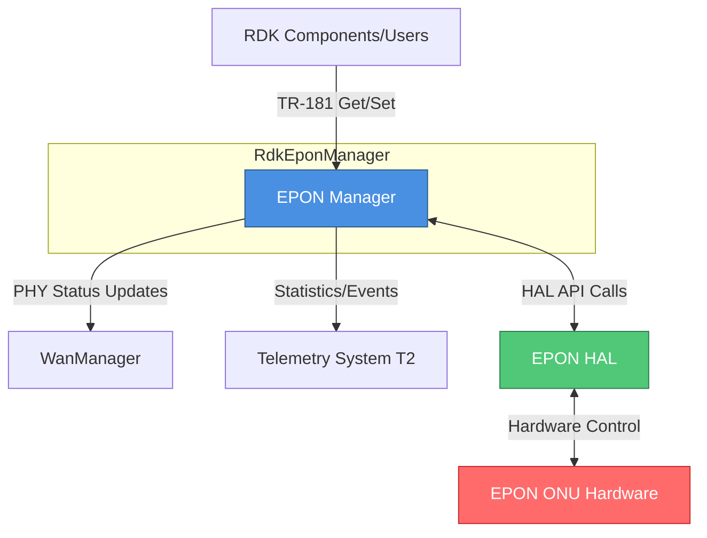
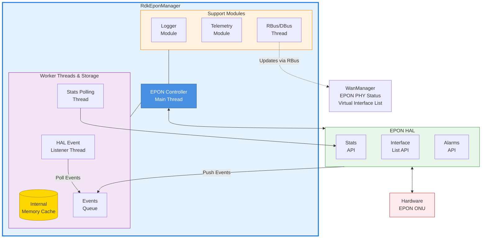
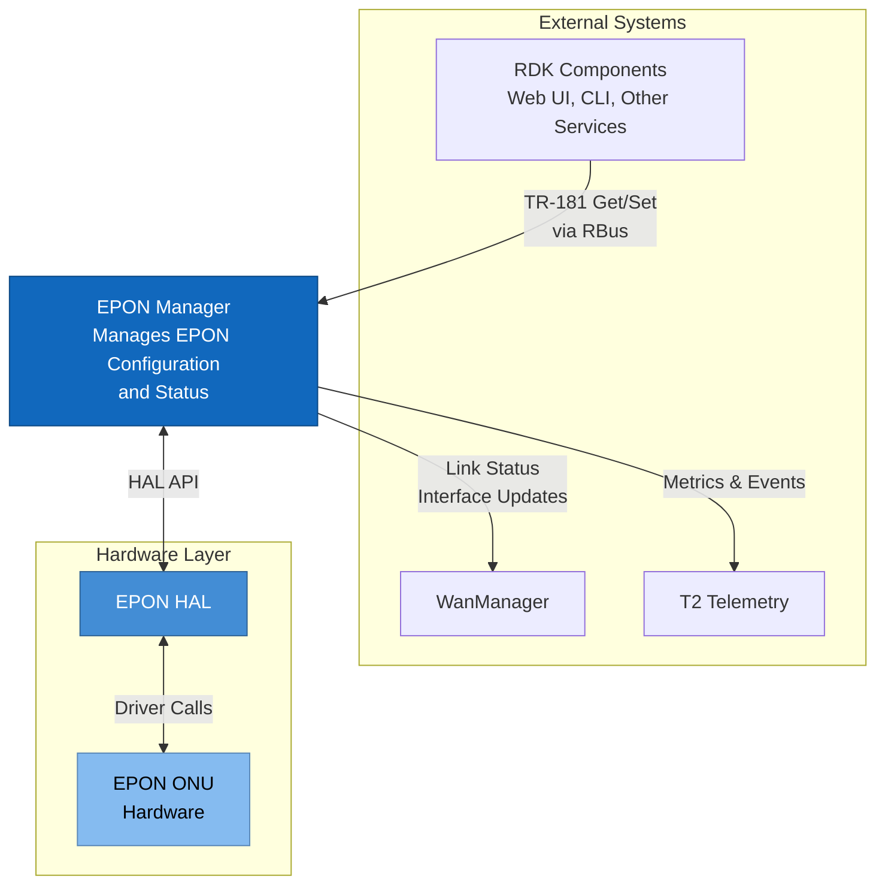
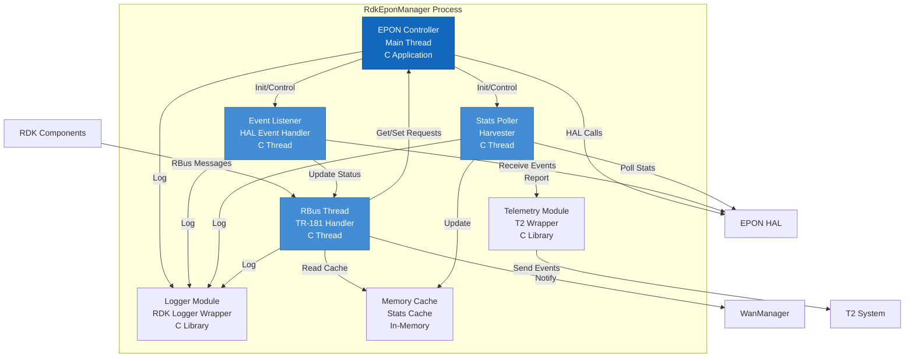
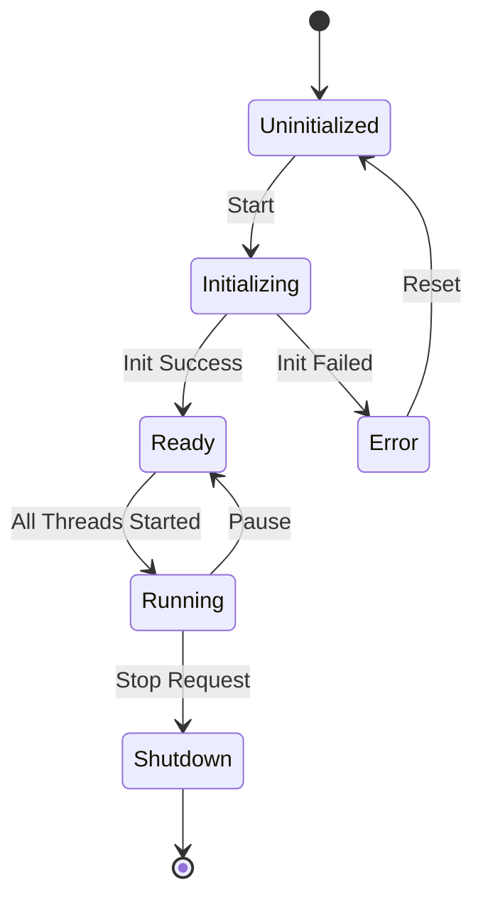

# System Architecture

## High-Level Architecture

### System Context



## Component Architecture

### Block Diagram



## C4 Model Diagrams

### Level 1: System Context



### Level 2: Container Diagram



## Controller State Machine



## TR-181 Data Model

```
Device.Ethernet.Link.{i}.
 Enable
 Status
 Name
 MACAddress
 Stats.
    BytesSent
    BytesReceived
    PacketsSent
    PacketsReceived
    ErrorsSent
    ErrorsReceived

Device.EPON.
 ONU.{i}.
   Enable
   Status
   LLID
   MACAddress
 Link.{i}.
    Status
    InterfaceList
```

## System Layers

| Layer | Components | Responsibility |
|-------|-----------|----------------|
| **Application Layer** | RDK Components, WebUI, CLI | User interaction and high-level control |
| **Service Layer** | WanManager, Telemetry (T2) | System services and coordination |
| **Manager Layer** | RdkEponManager | EPON-specific management and orchestration |
| **Abstraction Layer** | EPON HAL | Hardware abstraction and driver interface |
| **Hardware Layer** | EPON ONU | Physical EPON hardware |

## Communication Patterns

### Bus Communication (RBus)
- **Pattern**: Request-Response, Publish-Subscribe
- **Protocol**: RBus/DBus
- **Usage**: TR-181 GET/SET, Event notifications

### Event Queue
- **Pattern**: Producer-Consumer
- **Implementation**: Thread-safe queue
- **Usage**: HAL events to Event Listener

### Shared Memory
- **Pattern**: Cache with TTL
- **Synchronization**: Mutex-protected
- **Usage**: Statistics caching

---

**Document Version:** 1.0  
**Last Updated:** December 2, 2025
