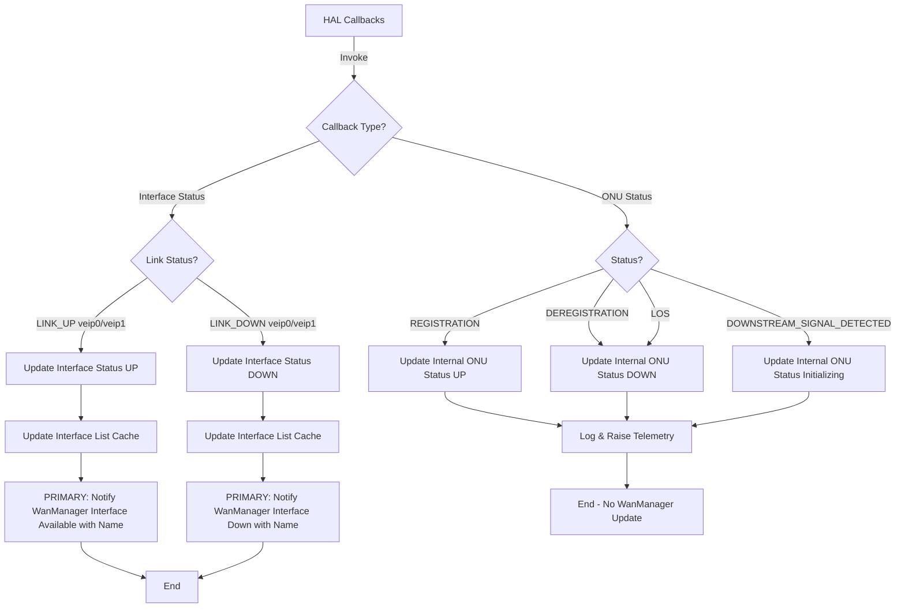
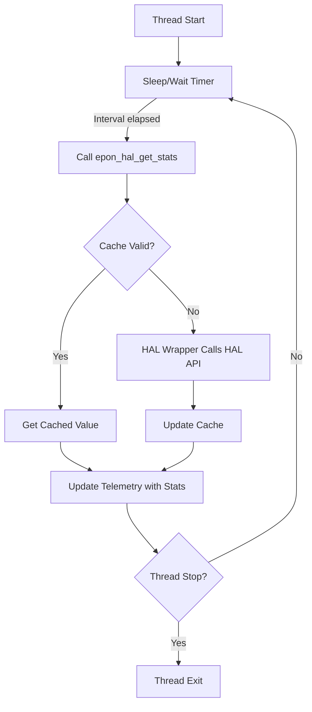
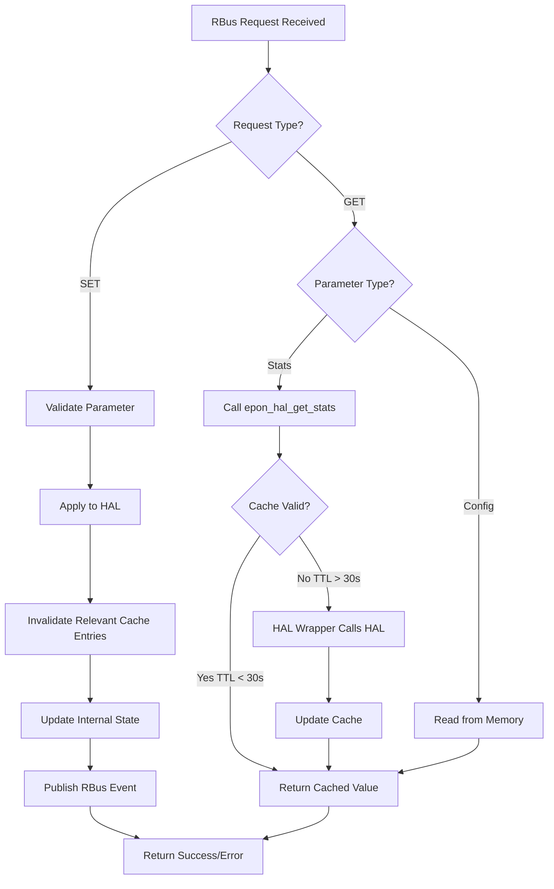
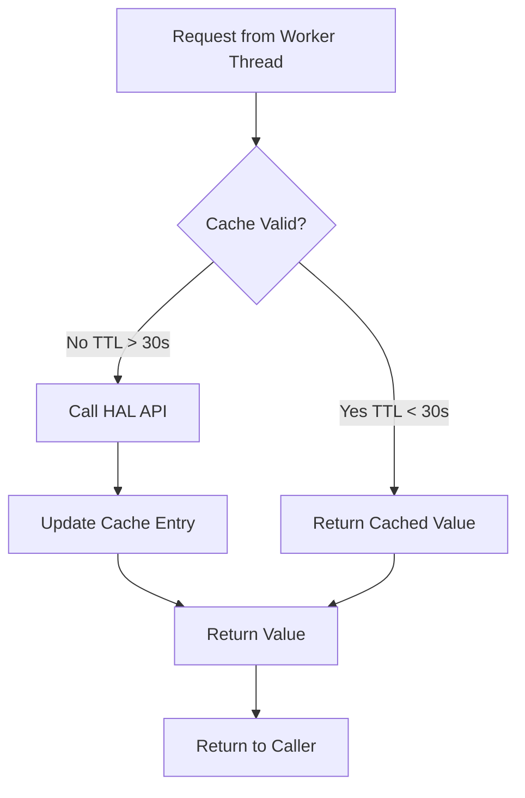

# Component Design

## 1. EPON Controller (Main Component)

### Responsibilities
- Initialize all subsystems (logger, RBus, telemetry, HAL)
- Coordinate between threads and modules
- Main event loop and lifecycle management
- Resource cleanup on shutdown

### Initialization Sequence

```
epon_controller_init()
  > logger_init()
  > rbus_thread_start()
  > telemetry_init()
  > epon_data_init()
  > hal_event_listener_start()
  > hal_init()
      - Register onu_status_callback
      - Register interface_status_callback
      - Register alarm_callback
  > stats_polling_thread_start()
```

### Key Functions
- System initialization and startup
- Thread creation and management
- Graceful shutdown handling
- Error recovery coordination

---

## 2. HAL Event Listener Thread

### Responsibilities
- Receive events from EPON HAL via registered callbacks
- Parse and categorize incoming events (ONU status and interface status)
- Dispatch events to appropriate handlers
- Maintain event processing statistics

### Event Types Handled

#### ONU Status Callback Events (epon_onu_status_t)
Simplified overall ONU status. **These events are for internal state tracking and logging only—they do NOT trigger WanManager updates.**

**Respective `epon_onu_interface_status_t` should be updated by the HAL in case of ONU status changes.**

- **EPON_ONU_STATUS_LOS** (Loss of Signal):
  - Update internal EPON ONU status to DOWN
  - Log event with WARNING severity
  - Raise telemetry event

- **EPON_ONU_STATUS_DOWNSTREAM_SIGNAL_DETECTED**:
  - Update internal EPON ONU status to Initializing
  - Log transition state

- **EPON_ONU_STATUS_REGISTRATION**:
  - Update internal EPON ONU status to UP
  - Log successful registration
  - Raise telemetry event

- **EPON_ONU_STATUS_DEREGISTRATION**:
  - Update internal EPON ONU status to DOWN
  - Log deregistration event
  - Raise telemetry event

#### Interface Status Callback Events (epon_onu_interface_status_t)
**PRIMARY EVENT**: Per-interface status changes for virtual interfaces (veip0, veip1, etc.). **These events trigger WanManager updates.**

- **Interface LINK_UP** (e.g., veip0):
  - Update interface status in internal cache
  - Add interface to active interface list
  - **Notify WanManager of interface availability via RBus** (primary action)
        - If any of the interfaces go UP, WanManager should be notified that EPON PHY is UP
        - Update WanManager virtual interface list with interface name and status
  - Raise telemetry event for interface UP
  
- **Interface LINK_DOWN** (e.g., veip0):
  - Update interface status in internal cache  
  - Remove interface from active interface list
  - **Notify WanManager of interface down via RBus** (primary action)
        - If all of the interfaces go DOWN, WanManager should be notified that EPON PHY is DOWN
        - Update WanManager virtual interface list with interface name and status
  - Raise telemetry event for interface DOWN

### Event Processing Flow



---

## 3. Stats Polling Thread (Harvester)

### Responsibilities
- Periodically poll statistics from EPON HAL
- Update internal cache with fresh data
- Push statistics to telemetry system
- Maintain polling schedule

### Configuration
- **Default Interval**: 15 minutes (900 seconds)
- **Configurable**: Via rbus 
- **Optional**: Can be disabled if not needed

### Operation Flow



### Statistics Collected
- Interface statistics (TX/RX bytes, packets, errors)
- ONU operational parameters
- Link quality metrics
- Performance counters

---

## 4. RBus/DBus Thread

### Responsibilities
- Initialize and maintain bus connection
- Register TR-181 DML parameters
- Handle incoming GET/SET requests
- Publish events to other RDK components
- Update WanManager with PHY status and interface list

### TR-181 Request Handling



### Key Operations
- DML parameter registration
- Request validation and processing
- Cache-aware GET operations
- Event publication
- WanManager interface

---

## 5. Telemetry Module

### Responsibilities
- Register with T2 telemetry system
- Format and report telemetry events
- Submit periodic statistics
- Handle telemetry markers

### Integration Points
- T2 telemetry service
- Event formatting and submission
- Statistics aggregation
- Marker management

### Event Types
- **Link events**: UP/DOWN transitions
- **Alarm events**: Critical/Error alarms
- **Statistics events**: Periodic metrics
- **Error events**: System errors

---

## 6. Logger Module

### Responsibilities
- Initialize RDK logger subsystem
- Provide logging API wrapper
- Support multiple log levels
- Optional HAL logging integration

### Log Levels

| Level | Usage | Example |
|-------|-------|---------|
| **FATAL** | System-critical errors | Failed initialization |
| **ERROR** | Component errors | HAL call failure |
| **WARNING** | Abnormal conditions | Cache miss threshold |
| **INFO** | Normal operations | Link status change |
| **DEBUG** | Detailed debugging | Event queue details |

### Features
- Runtime log level configuration
- Component-specific logging
- HAL library integration (optional)
- Thread-safe logging

---

## 7. HAL Wrapper with Cache

### Responsibilities
- Provide abstraction layer for HAL calls
- Cache statistics with TTL (Time To Live)
- Check cache validity before making HAL calls
- Thread-safe access with automatic expiration
- Forward calls to HAL only when cache miss occurs
- Memory management for cached data

### Architecture




### Cache Operations
- **Get**: Retrieve value with cache validity check
- **Set**: Store value and invalidate if needed
- **Invalidate**: Force cache expiration
- **Cleanup**: Remove expired entries

### Cache Policy
- **TTL**: 30 seconds (default, configurable)
- **Strategy**: Time-based expiration with lazy cleanup
- **Thread Safety**: Mutex-protected (RW lock recommended)
- **Bypass**: Controller can bypass cache for direct HAL calls

---


## Error Handling

### Strategy
- **Initialization Errors**: Retry with backoff, log and exit if persistent
- **Runtime Errors**: Log, attempt recovery, continue operation
- **Critical Errors**: Notify watchdog, trigger restart if needed

### Recovery Mechanisms
1. **HAL Failure**: Retry with exponential backoff (max 3 attempts)
2. **RBus Disconnection**: Auto-reconnect with retry logic
3. **Thread Crash**: Watchdog detection and restart
4. **Cache Corruption**: Clear and rebuild cache
5. **Memory Issues**: Cleanup and resource management

---

**Document Version:** 1.0  
**Last Updated:** December 2, 2025
