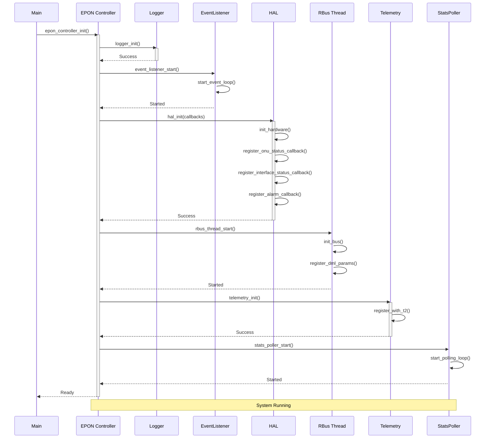
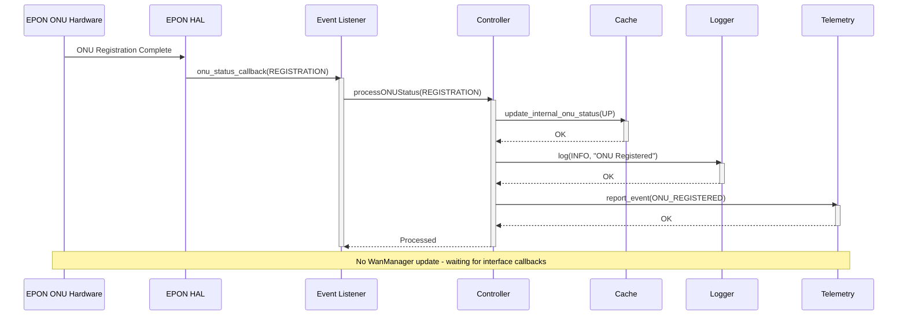
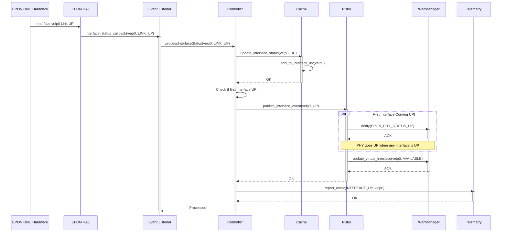
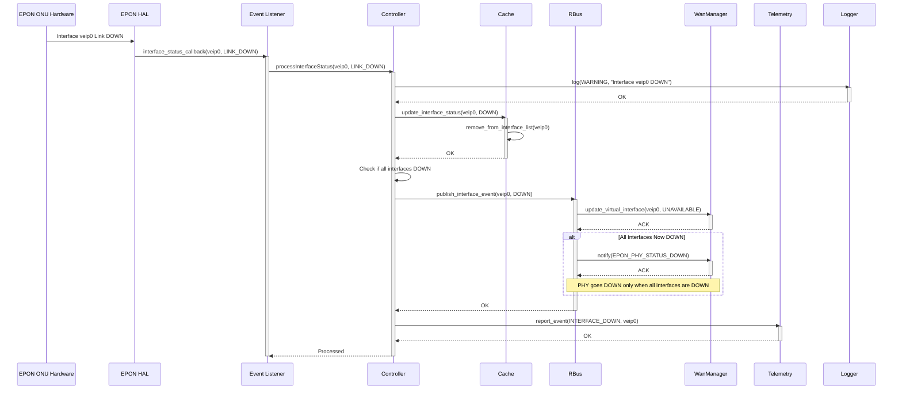
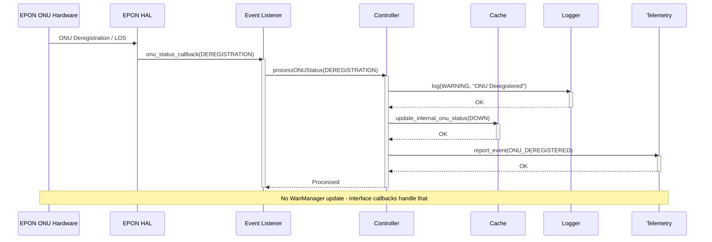
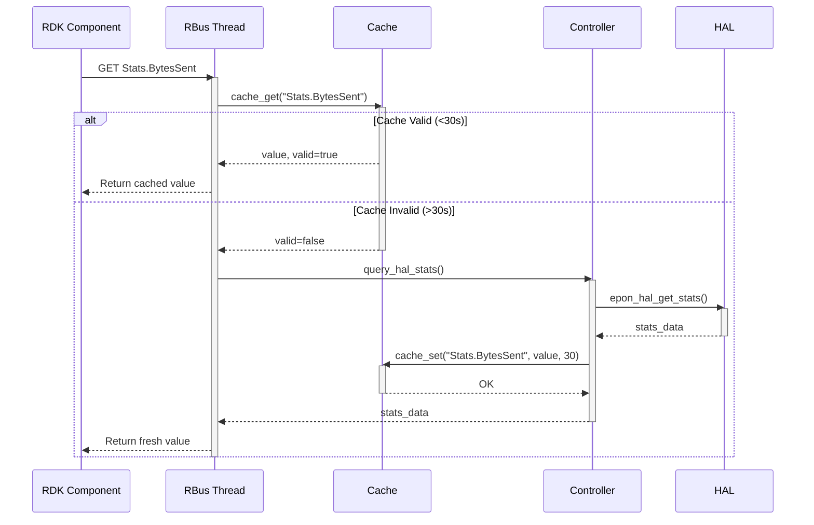
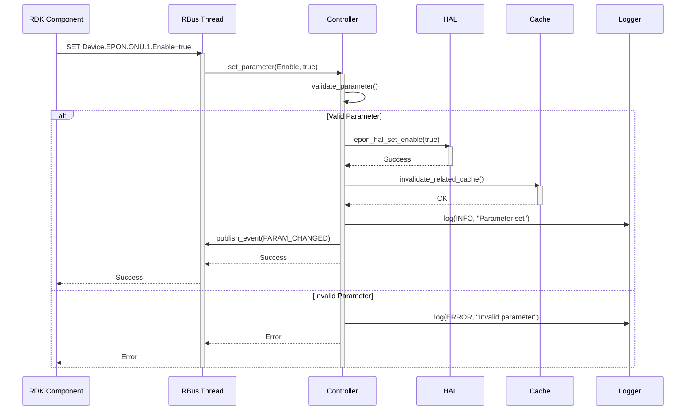
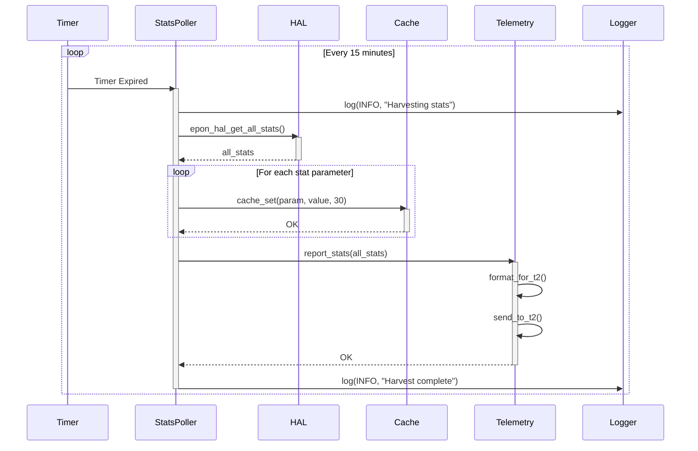
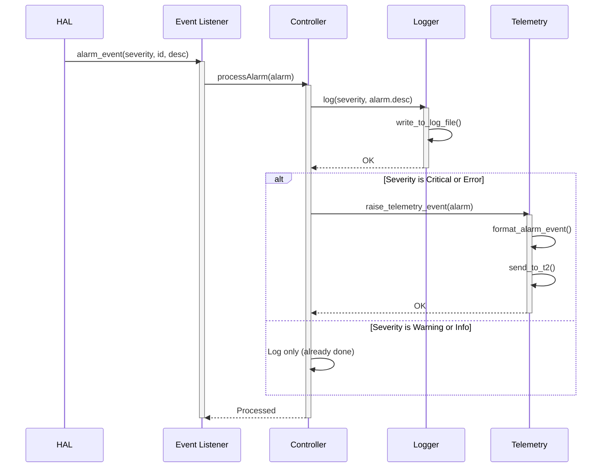
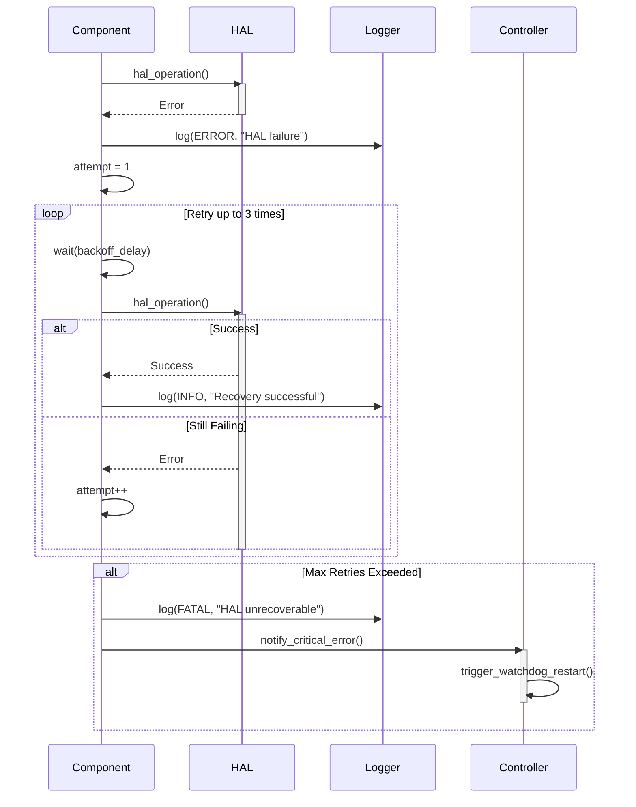

# Sequence Diagrams

## 1. System Startup Sequence

---

## 2. ONU Registration Event Sequence (Internal State Only)

---

## 3. Interface Link UP Event Sequence

---

## 4. Interface Link DOWN Event Sequence

---

## 5. ONU Deregistration Event Sequence (Internal State Only)

---

## 6. TR-181 GET Request with Cache

---

## 7. TR-181 SET Request

---

## 8. Stats Harvesting Sequence

---

## 9. Alarm Event Sequence

---

## 10. Error Recovery Sequence

---

**Document Version:** 1.0  
**Last Updated:** December 2, 2025
