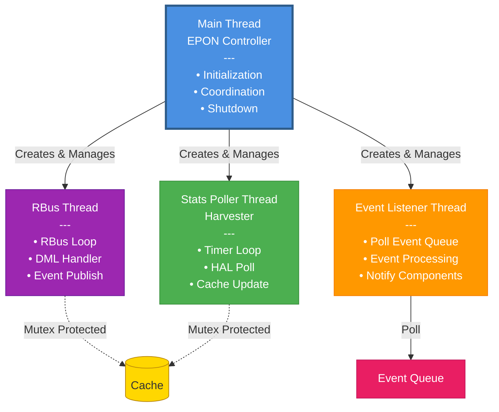
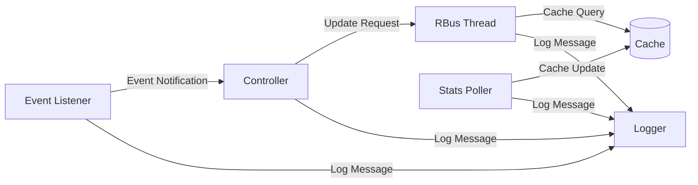

# Thread Architecture

## Thread Overview



## Thread Details

### 1. Main Thread (EPON Controller)

**Purpose:** System initialization, coordination, and shutdown management

**Responsibilities:**
- Initialize all subsystems
- Create and manage worker threads
- Handle signals and shutdown requests
- Coordinate resource cleanup

**Lifecycle:**
```
START  INIT  CREATE_THREADS  MONITOR  SHUTDOWN  EXIT
```

**Key Functions:**
- `epon_controller_init()` - Initialize subsystems
- `epon_controller_start()` - Start all threads
- `epon_controller_stop()` - Graceful shutdown
- `signal_handler()` - Handle OS signals

---

### 2. RBus/DBus Thread

**Purpose:** Handle bus communication and TR-181 operations

**Responsibilities:**
- Initialize RBus/DBus connection
- Register TR-181 DML parameters
- Process GET/SET requests
- Publish events to other components
- Maintain bus connection health

**Thread Loop:**
```
while (running) {
    wait_for_rbus_event()
    if (request_received) {
        process_request()
        send_response()
    }
    if (event_to_publish) {
        publish_event()
    }
}
```

**Synchronization:**
- Mutex for cache access
- Message queue for inter-thread communication

---

### 3. HAL Event Listener Thread

**Purpose:** Process events from EPON HAL

**Responsibilities:**
- Poll HAL event queue
- Categorize and dispatch events
- Update system state based on events
- Notify other components

**Thread Loop:**
```
while (running) {
    event = poll_hal_event_queue()
    if (event) {
        switch(event.type) {
            case ONU_STATUS:
                process_onu_status(event)
                break
            case ALARM:
                process_alarm(event)
                break
        }
    }
    sleep(poll_interval)
}
```

**Event Processing Time:**
- Target: < 50ms per event
- Maximum: < 100ms per event

---

### 4. Stats Polling Thread (Harvester)

**Purpose:** Periodic statistics collection and reporting

**Responsibilities:**
- Poll HAL for statistics at regular intervals
- Update internal cache with fresh data
- Report statistics to telemetry
- Track polling health

**Thread Loop:**
```
while (running) {
    wait_for_interval(15_minutes)
    if (time_to_poll) {
        stats = poll_hal_stats()
        update_cache(stats)
        report_to_telemetry(stats)
    }
}
```

**Configuration:**
- Default interval: 15 minutes (900 seconds)
- Configurable
- Can be disabled if not needed

---

## Thread Synchronization

### Synchronization Primitives

```c
// Mutex for cache access
pthread_mutex_t cache_mutex;

// Condition variable for event notification
pthread_cond_t event_cond;

// Thread-safe event queue
typedef struct {
    queue_t queue;
    pthread_mutex_t mutex;
    pthread_cond_t cond;
} thread_safe_queue_t;
```

### Critical Sections

| Resource | Protected By | Accessed By |
|----------|-------------|-------------|
| **Stats Cache** | `cache_mutex` | RBus Thread, Stats Poller |
| **Event Queue** | Queue mutex | HAL (producer), Event Listener (consumer) |
| **Configuration** | RW lock | All threads (read), RBus (write) |
| **Logger** | Internal mutex | All threads |

### Lock Ordering

To prevent deadlocks, locks must be acquired in this order:

1. Configuration lock (if needed)
2. Cache lock (if needed)
3. Queue lock (if needed)

**Never acquire locks in reverse order!**

---

## Thread Communication

### Inter-Thread Communication Patterns



### Message Passing

- **Event Queue**: HAL events  Event Listener
- **Function Calls**: Direct calls with mutex protection
- **Shared Memory**: Cache with mutex protection
- **Signals**: Condition variables for thread wake-up

---

## Thread Lifecycle Management

### Thread Creation

```c
// Create RBus thread
pthread_create(&rbus_tid, NULL, rbus_thread_func, &context);

// Create Event Listener thread
pthread_create(&event_tid, NULL, event_listener_func, &context);

// Create Stats Poller thread (optional)
if (config.enable_stats_polling) {
    pthread_create(&stats_tid, NULL, stats_poller_func, &context);
}
```

### Thread Shutdown

```c
// Signal all threads to stop
rbus_thread_stop = true;
event_listener_stop = true;
stats_poller_stop = true;

// Wake threads if sleeping
pthread_cond_broadcast(&event_cond);

// Wait for threads to exit
pthread_join(rbus_tid, NULL);
pthread_join(event_tid, NULL);
if (stats_tid) {
    pthread_join(stats_tid, NULL);
}
```

---

## Thread Safety Considerations

### Safe Practices

 **DO:**
- Always use mutexes for shared data access
- Use condition variables for thread signaling
- Initialize mutexes before thread creation
- Destroy mutexes after threads exit
- Check return values of pthread functions
- Use timeouts on blocking operations

 **DON'T:**
- Access shared data without locks
- Hold locks longer than necessary
- Call blocking functions while holding locks
- Create circular lock dependencies
- Ignore thread errors

---

## Performance Considerations

### Thread Priorities

| Thread | Priority | Reason |
|--------|----------|--------|
| **Event Listener** | High | Real-time event processing |
| **RBus Thread** | Normal | Request-response handling |
| **Stats Poller** | Low | Background task |
| **Main Thread** | Normal | Coordination |

### CPU Affinity

- Not set by default
- Can be configured for real-time systems

### Memory Usage

| Thread | Stack Size | Heap Usage |
|--------|-----------|------------|
| **Main** | Default (8MB) | ~2MB |
| **RBus** | Default | ~1MB |
| **Event Listener** | Default | ~1MB |
| **Stats Poller** | Default | ~500KB |

**Total Memory Footprint:** ~10-15MB

---

## Error Handling

### Thread Crash Handling

```c
// Register signal handlers
signal(SIGSEGV, thread_crash_handler);
signal(SIGABRT, thread_crash_handler);

void thread_crash_handler(int sig) {
    log_critical("Thread crashed with signal %d", sig);
    
    // Notify watchdog
    notify_watchdog();
    
    // Attempt graceful shutdown
    epon_controller_stop();
    
    exit(1);
}
```

### Thread Health Monitoring

- Watchdog timer per thread
- Heartbeat mechanism
- Automatic restart on hang detection

---

## Deadlock Prevention

### Detection Strategy

- Lock timeout mechanism (5 seconds)
- Consistent lock ordering
- Lock hierarchy enforcement

```c
#define LOCK_TIMEOUT_MS 5000

int safe_mutex_lock(pthread_mutex_t *mutex) {
    struct timespec timeout;
    clock_gettime(CLOCK_REALTIME, &timeout);
    timeout.tv_sec += LOCK_TIMEOUT_MS / 1000;
    
    int ret = pthread_mutex_timedlock(mutex, &timeout);
    if (ret == ETIMEDOUT) {
        log_error("Mutex lock timeout - possible deadlock");
        return -1;
    }
    return ret;
}
```

---

## Thread Debugging

### Debug Logging

```c
// Thread entry/exit logging
#define THREAD_ENTER() log_debug("[%s] Thread entered", __FUNCTION__)
#define THREAD_EXIT()  log_debug("[%s] Thread exiting", __FUNCTION__)

// Lock debugging
#define LOCK_TRACE()   log_debug("[%s] Acquiring lock", __FUNCTION__)
#define UNLOCK_TRACE() log_debug("[%s] Releasing lock", __FUNCTION__)
```

### Tools

- **gdb**: Attach to running process, examine threads
- **valgrind --tool=helgrind**: Detect race conditions
- **strace -f**: Trace system calls from all threads

---

**Document Version:** 1.0  
**Last Updated:** December 2, 2025
