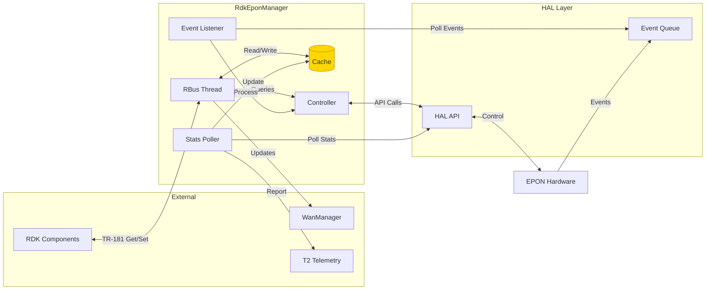
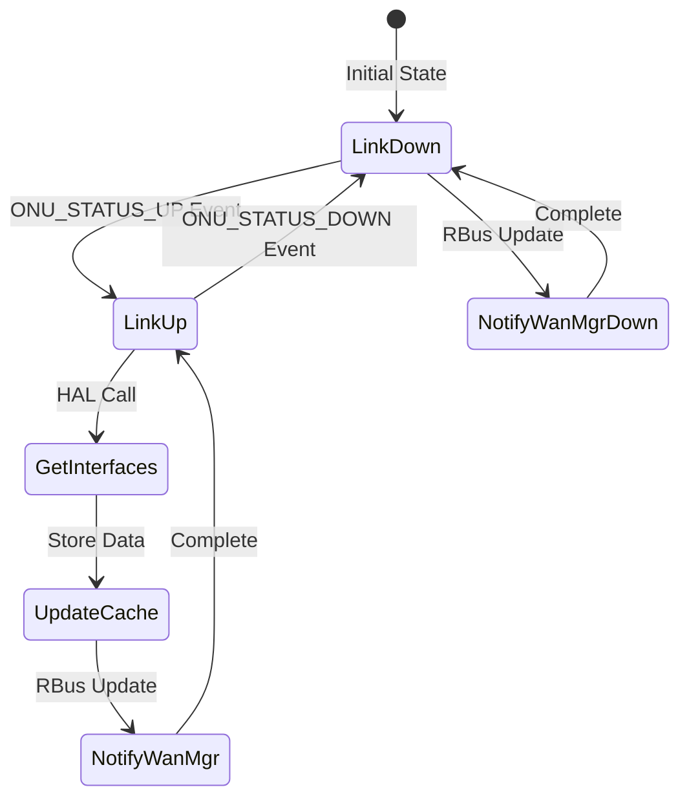

# Data Flow

## Overall Data Flow



## Event Data Flow

### HAL Event to WanManager

```
Hardware Event
    
HAL Event Queue
    
Event Listener Thread (polls)
    
Controller (processEvent)
    

                              
ONU Status Event          Alarm Event
                              
 Link UP                      Log with severity
   Get Interface List        Raise telemetry (if critical)
   Update Cache
   Notify via RBus
      WanManager
         PHY Status UP
         Interface List

 Link DOWN
    Notify via RBus
       WanManager
          PHY Status DOWN
```

## Statistics Data Flow

### Periodic Harvesting

```
Timer (15 min)
    
Stats Polling Thread
    
epon_hal_get_stats()
    
HAL Returns Stats
    

                   
Update Cache    Report to Telemetry
                   
Cache Entry         T2 System
(TTL: 30s)          (Metrics Storage)
```

### On-Demand Query

```
RDK Component
    
TR-181 GET Request (via RBus)
    
RBus Thread
    
Check Cache
    

                  
Cache Hit       Cache Miss
(< 30s)         (> 30s)
                  
Return          Query HAL
Cached             
Value           Get Stats
                   
                Update Cache
                   
                Return Value
```

## Configuration Data Flow

### TR-181 SET Request

```
RDK Component
    
TR-181 SET Request
(Device.EPON.ONU.1.Enable=true)
    
RBus Thread
    
Validate Parameter
    

                
Valid         Invalid
                
Controller    Return Error

Apply to HAL
(epon_hal_set_enable)

Invalidate Cache

Log Operation

Publish RBus Event
(Parameter Changed)

Return Success
```

## Control Flow

### Link State Changes



## Data Structures Flow

### Cache Entry Lifecycle

```
Create Entry
    
Set Value
    
Set Timestamp (current time)
    
Set TTL (30 seconds)
    
Store in Cache
    

  Time Passes    

    
Read Request
    
Check Timestamp
    

                  
Valid            Expired
(< TTL)          (> TTL)
                  
Return Value    Mark Invalid
                   
                Remove/Update
```

## Message Flow Patterns

### Request-Response (TR-181 GET)

```
Client GET> RBus Thread
                    
                    Query> Controller
                                  
                                  Read> HAL
                                             
                                  <Data
                                  
                    <Response
                    
Client <Data
```

### Publish-Subscribe (Events)

```
HAL Event
    
Event Listener
    
Process Event
    
RBus Thread
    
Publish Event
    

                
WanManager    Other Subscribers
(consumes)    (consume)
```

## Telemetry Data Flow

```
     
  Stats Poller          Event Listener  
   (Periodic)             (On Event)    
     
                                
           Collect Stats          Process Event
                                
         
                   
                   
          Telemetry Module
                   
                    Format Data
                    Add Markers
                    Add Timestamps
                   
                   
            T2 Telemetry System
                   
                    Storage
                    Analytics
                    Reporting
```

## Data Transformation

### HAL Stats to TR-181 Format

```
HAL Statistics
 tx_bytes: 1234567
 rx_bytes: 7654321
 tx_packets: 1000
 rx_packets: 2000
 tx_errors: 5
 rx_errors: 3

         
           Transform

TR-181 Parameters
 Device.Ethernet.Link.1.Stats.BytesSent: "1234567"
 Device.Ethernet.Link.1.Stats.BytesReceived: "7654321"
 Device.Ethernet.Link.1.Stats.PacketsSent: "1000"
 Device.Ethernet.Link.1.Stats.PacketsReceived: "2000"
 Device.Ethernet.Link.1.Stats.ErrorsSent: "5"
 Device.Ethernet.Link.1.Stats.ErrorsReceived: "3"
```

## Memory Dataflow

### Cache Memory Usage

```
Application Memory Space

 Code Segment (Read-Only)
   RdkEponManager Binary

 Data Segment
   Global Variables
   Static Data

 Heap
   Cache Entries (Dynamic)
     Entry 1: param_name, value, timestamp, TTL
     Entry 2: param_name, value, timestamp, TTL
     Entry N: ...
  
   Event Queue (Dynamic)
   Other Dynamic Allocations

 Stack (Per Thread)
    Main Thread Stack
    RBus Thread Stack
    Event Listener Stack
    Stats Poller Stack
```

## Error Propagation

```
Error Detected
    
Log Error
    

                
Recoverable   Critical
                
Retry         Notify Watchdog
                
            
               
OK  Fail      Restart
             Process
   
Return  Propagate
Success Error
```

## Performance Optimization Flow

### Cache-First Strategy

```
Request
    
Check Cache First 
                     
Cache Hit?            
     Yes: Return    
       (Fast Path)   
                     
     No: Query HAL  
       (Slow Path)    
                     
     Get Data         
                     
     Update Cache 
        
     Return Data
```

---

**Document Version:** 1.0  
**Last Updated:** December 2, 2025
