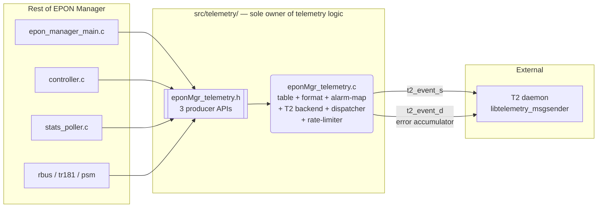
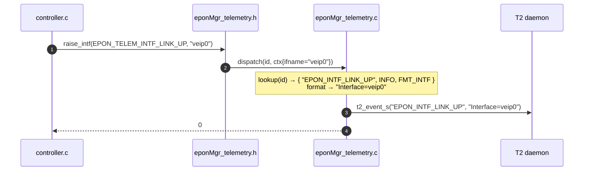
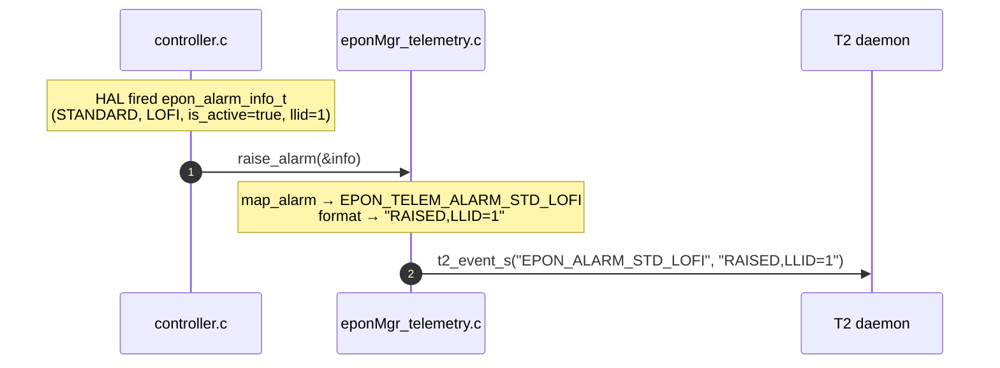
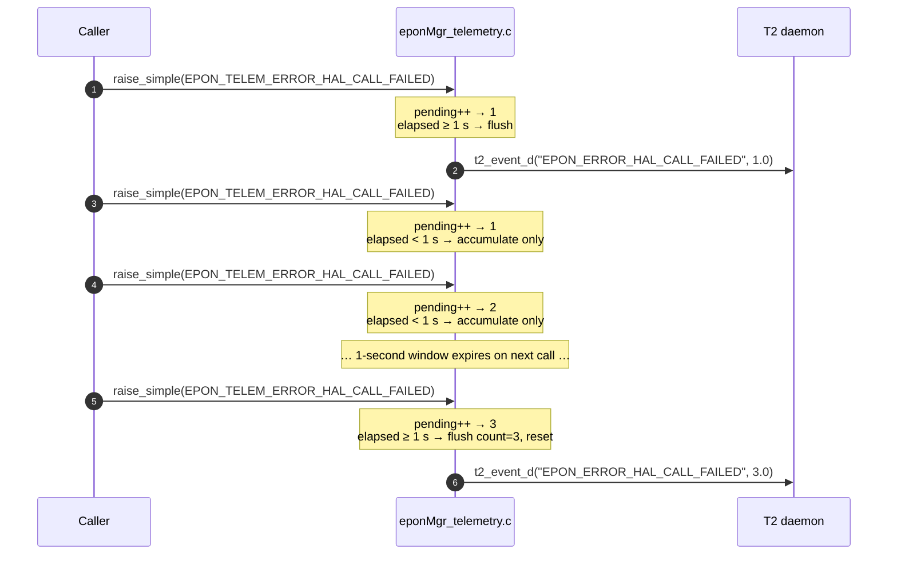
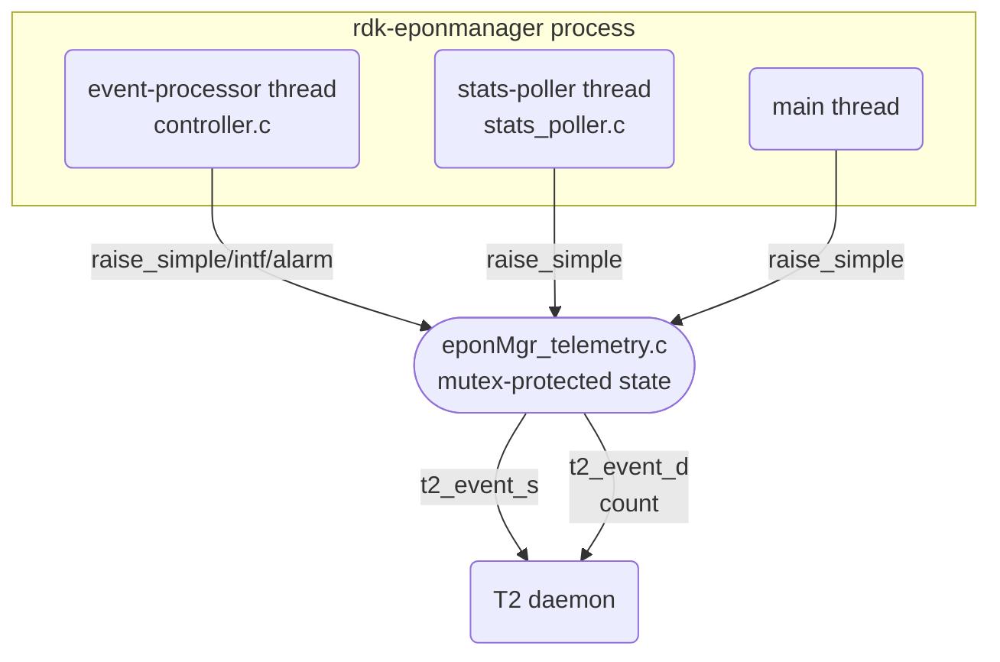
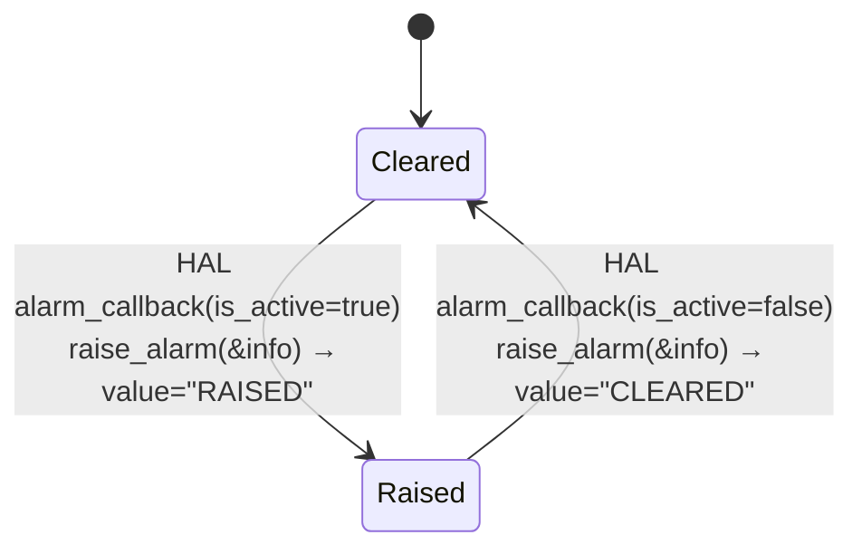
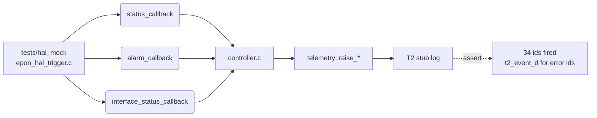

# EPON Manager — Telemetry Design

**Version:** 1.2  |  **Date:** May 15, 2026
**Owner:** EPON Manager team
**Spec:** [EPON_Manager_Reference_v2.md](EPON_Manager_Reference_v2.md) §2 (Telemetry Events)
**Acceptance Criteria:** [09_Telemetry_Acceptance_Criteria.md](09_Telemetry_Acceptance_Criteria.md)

> *Version 1.2: Merged implementation plan (formerly doc 07) and module design
> (formerly doc 08) into a single reference. Added rate-limiting and
> accumulative T2 API for error events.*

---

## 1. Goals

Replace the current scaffold (`src/telemetry/eponMgr_telemetry.{c,h}`) with a
production-grade telemetry layer that:

1. **Encapsulates** all marker selection, formatting, severity mapping, and T2
   dispatch inside `src/telemetry/` — no marker strings anywhere else.
2. **Exposes only three event-firing APIs.** Callers pass an *event id*; they
   never construct marker names or value strings.
3. **Implements all 34 telemetry markers** defined in the Reference §2.
4. **Rate-limits error events** (§2.6) to max 1 report per second per marker
   using the accumulative T2 API (`t2_event_d`).

> **Out of scope:** Periodic statistics Avro report (Harvester) is deferred.
> See [10_Harvester_Future_Direction.md](10_Harvester_Future_Direction.md).

---

## 2. Design goals

1. **Single producer surface** — the rest of the code base only knows *event
   ids*. Marker names, severity, value formatting and T2 dispatch are all hidden
   inside `src/telemetry/`.
2. **Replaceable backend** — T2 stub vs. real `libtelemetry_msgsender` is
   guarded at link/compile time only. Caller code never changes.
3. **Independent error reporting** — T2 backend failure must not cascade to
   the producer caller; telemetry hiccups are logged and suppressed.

---

## 3. Decisions (frozen)

| # | Topic | Decision |
|---|-------|----------|
| 1 | Producer API | **Three** entry points only — `_raise_simple()`, `_raise_intf()`, `_raise_alarm()` — backed by a single `_raise(id, ctx)` dispatcher. |
| 2 | Alarm raised/cleared | **One** event id per alarm; `RAISED`/`CLEARED` state encoded in the marker value. |
| 3 | Existing `eponMgr_telemetry.{c,h}` | Treated as a template — free to rewrite. Old per-stat marker APIs removed. |
| 4 | Error event rate-limiting | Max 1 `t2_event_d` call per second per error marker; occurrences within the window are **accumulated** and sent as a count. |
| 5 | Harvester (Avro report) | **Deferred.** See [10_Harvester_Future_Direction.md](10_Harvester_Future_Direction.md). |

---

## 4. Public API (final shape)

Declared in [`include/eponMgr_telemetry.h`](../include/eponMgr_telemetry.h).

```c
/* ---- Event id catalog (1-to-1 with Reference §2) ----------------- */
typedef enum {
    /* §2.1 ONU Status Events */
    EPON_TELEM_ONU_LOS,
    EPON_TELEM_ONU_DOWNSTREAM_SIGNAL_DETECTED,
    EPON_TELEM_ONU_REGISTRATION,
    EPON_TELEM_ONU_DEREGISTRATION,

    /* §2.2 Interface Link Status Events */
    EPON_TELEM_INTF_LINK_UP,
    EPON_TELEM_INTF_LINK_DOWN,
    EPON_TELEM_PHY_STATUS_UP,
    EPON_TELEM_PHY_STATUS_DOWN,

    /* §2.3 Standard IEEE 802.3ah Alarms (RAISED/CLEARED via ctx) */
    EPON_TELEM_ALARM_STD_LOFI,
    EPON_TELEM_ALARM_STD_ERROR_SYMBOL_PERIOD,
    EPON_TELEM_ALARM_STD_ERROR_FRAME,
    EPON_TELEM_ALARM_STD_ERROR_FRAME_PERIOD,
    EPON_TELEM_ALARM_STD_ERROR_FRAME_SECONDS,
    EPON_TELEM_ALARM_STD_OAM_SESSION_LOST,
    EPON_TELEM_ALARM_STD_EQUIPMENT_FAILURE,

    /* §2.4 Vendor-Specific (DPoE) Alarms */
    EPON_TELEM_ALARM_VENDOR_LOS,
    EPON_TELEM_ALARM_VENDOR_DYING_GASP,
    EPON_TELEM_ALARM_VENDOR_POWER_LOW,
    EPON_TELEM_ALARM_VENDOR_POWER_HIGH,
    EPON_TELEM_ALARM_VENDOR_TEMPERATURE,
    EPON_TELEM_ALARM_VENDOR_FEC_THRESHOLD,
    EPON_TELEM_ALARM_VENDOR_LASER_BIAS_CURRENT,
    EPON_TELEM_ALARM_VENDOR_SUPPLY_VOLTAGE,

    /* §2.5 System Lifecycle */
    EPON_TELEM_SYSTEM_INIT_SUCCESS,
    EPON_TELEM_SYSTEM_INIT_FAILURE,
    EPON_TELEM_SYSTEM_SHUTDOWN,
    EPON_TELEM_SYSTEM_HAL_WRONG_PON_MODE,
    EPON_TELEM_SYSTEM_FACTORY_RESET,
    EPON_TELEM_SYSTEM_ONU_RESET,

    /* §2.6 Error Events (rate-limited, accumulative) */
    EPON_TELEM_ERROR_HAL_CALL_FAILED,
    EPON_TELEM_ERROR_EVENT_QUEUE_FULL,
    EPON_TELEM_ERROR_STATS_COLLECTION_FAILED,
    EPON_TELEM_ERROR_RBUS_PUBLISH_FAILED,
    EPON_TELEM_ERROR_PSM_ACCESS_FAILED,

    EPON_TELEM_EVENT_ID_MAX
} eponMgr_telemetry_event_id_t;


/* ---- The three producer APIs --------------------------------------- */
int eponMgr_telemetry_raise_simple(eponMgr_telemetry_event_id_t id);

int eponMgr_telemetry_raise_intf  (eponMgr_telemetry_event_id_t id,
                                   const char *ifname);

int eponMgr_telemetry_raise_alarm (const epon_alarm_info_t *info);


/* ---- Lifecycle ----------------------------------------------------- */
int  eponMgr_telemetry_init      (const char *component_name);
int  eponMgr_telemetry_cleanup   (void);
```

---

## 5. Module boundary



> Only `eponMgr_telemetry.h` crosses the module boundary.

---

## 6. File layout & responsibilities

The telemetry module is implemented in **1 `.c` file**.

| File | Owns |
|------|------|
| `eponMgr_telemetry.h` | Public surface: 34 event ids, 3 producer APIs, lifecycle APIs. Only header callers ever include. |
| `eponMgr_telemetry.c` | Self-contained event module. Five sections (all internals file-static). |

---

## 7. Internal design

All internal helpers are **file-static** — not exposed outside `src/telemetry/`.

### 7.1 Event descriptor table

```c
typedef enum { PRIO_INFO, PRIO_WARNING, PRIO_ERROR, PRIO_CRITICAL } priority_t;
typedef enum { FMT_NONE, FMT_INTF, FMT_ALARM } fmt_t;

typedef struct {
    const char *marker;
    priority_t  priority;
    fmt_t       fmt;
} event_desc_t;

static const event_desc_t k_table[EPON_TELEM_EVENT_ID_MAX] = {
    [EPON_TELEM_ONU_LOS]        = { "EPON_ONU_LOS",        PRIO_CRITICAL, FMT_NONE  },
    [EPON_TELEM_INTF_LINK_UP]   = { "EPON_INTF_LINK_UP",   PRIO_INFO,     FMT_INTF  },
    [EPON_TELEM_ALARM_STD_LOFI] = { "EPON_ALARM_STD_LOFI", PRIO_CRITICAL, FMT_ALARM },
    /* … 34 rows total — exact text per Reference §2 … */
};
```

### 7.2 Value formatter

Pure function `int format_value(desc, ctx, char *out, size_t cap)`:

| `fmt`        | Value template                                                |
|--------------|---------------------------------------------------------------|
| `FMT_NONE`   | `""`                                                          |
| `FMT_INTF`   | `"Interface=%s"`                                              |
| `FMT_ALARM`  | `"RAISED"` / `"CLEARED"` (`,LLID=%u` appended when `llid != 0xFFFF`) |

### 7.3 HAL alarm mapper

```c
static eponMgr_telemetry_event_id_t map_alarm(const epon_alarm_info_t *info);
```

Uses `info->alarm_type` plus `standard_alarm` / `vendor_alarm` enum values.

### 7.4 T2 backend — two send paths

**Regular events** (`t2_event_s`):
```c
static int t2_send(const char *marker, const char *value, priority_t prio);
```
Production: calls `t2_event_s(marker, value)`. Stub: log-only when `HAVE_LIBT2`
is undefined.

**Error events — accumulative** (`t2_event_d`):
```c
static int t2_send_count(const char *marker, uint64_t count, priority_t prio);
```
Calls `t2_event_d(marker, (double)count)` with the accumulated event count
for the rate-limit window. Reports how many times the error occurred rather
than spamming individual events.

### 7.5 Rate-limiter for error events

```c
#define ERROR_RATE_LIMIT_NS  1000000000LL   /* 1 second */

typedef struct {
    struct timespec last_sent;   /* CLOCK_MONOTONIC */
    uint64_t        pending;     /* accumulated count since last_sent */
} err_rate_t;
```

`dispatch_error(id)` logic:
1. Increment `rate[id].pending`.
2. Compute `elapsed = now − rate[id].last_sent`.
3. If `elapsed < 1 s`: return (accumulate without firing).
4. If `elapsed ≥ 1 s`: call `t2_send_count(marker, pending, prio)`, reset
   `pending = 0`, update `last_sent = now`.

Zero-initialised `last_sent` (Unix epoch) ensures the **first occurrence always
fires immediately**.

### 7.6 Dispatcher

`dispatch(id, ctx)`:
- Error event ids (`EPON_TELEM_ERROR_*`) → `dispatch_error(id)`.
- All others → table-lookup → enable check → `format_value` → `t2_send`.

The 3 public `_raise_*` entry points each build a `ctx_t` and call `dispatch`.

---

## 8. Sequence diagrams

### 8.1 Normal event raise



### 8.2 Alarm raise (RAISED / CLEARED)



### 8.3 Error event — rate-limited accumulative



---

## 9. Threading model



- Producer side is fully thread-safe — internal `pthread_mutex_t` in `g_state`.
- `t2_event_s` / `t2_event_d` are called **outside** the critical section.
- Rate-limit state (`rate[]`) and its timestamp are protected by the same mutex.

---

## 10. State machine — alarm raised/cleared



The alarm state is owned by the HAL; the telemetry module is **stateless** with
respect to alarms — it forwards each transition as one T2 event.

---

## 11. Error & resource handling

| Failure | Behaviour |
|---------|-----------|
| `_raise*` called before `_init` | Return `0`; increment `events_dropped`. |
| `_raise*` with unknown id | Return `-1`; log `WARN` once. |
| Error event within rate-limit window | Increment `pending`; return `0` silently. |
| T2 backend send error | Logged at `WARN`; producer return value unchanged so callers don't cascade-fail. |
| `clock_gettime` failure | Treated as `elapsed = 0`; event is accumulated, not dropped. |

---

## 12. Integration points (caller changes)

| Location | Old | New |
|----------|-----|-----|
| `epon_manager_main.c` after `init` ok | — | `raise_simple(EPON_TELEM_SYSTEM_INIT_SUCCESS)` |
| `epon_manager_main.c` init failure | log only | `raise_simple(EPON_TELEM_SYSTEM_INIT_FAILURE)` |
| `epon_manager_main.c` SIGTERM | log only | `raise_simple(EPON_TELEM_SYSTEM_SHUTDOWN)` |
| `controller.c::process_onu_status_event` | `// TODO` | `EPON_TELEM_ONU_{LOS/DOWNSTREAM.../REGISTRATION/DEREGISTRATION}` |
| `controller.c::process_interface_status_event` | `// TODO` | `_raise_intf(LINK_UP/DOWN)` + `_raise_simple(PHY_STATUS_UP/DOWN)` |
| `controller.c::process_alarm_event` | log only | `raise_alarm(&info)` |
| HAL-call error sites | log only | `raise_simple(EPON_TELEM_ERROR_HAL_CALL_FAILED)` |
| `queue.c` push fail | log only | `raise_simple(EPON_TELEM_ERROR_EVENT_QUEUE_FULL)` |
| `stats_poller.c` collect failure | log only | `raise_simple(EPON_TELEM_ERROR_STATS_COLLECTION_FAILED)` |
| `rbus.c` publish failure | log only | `raise_simple(EPON_TELEM_ERROR_RBUS_PUBLISH_FAILED)` |
| `psm.c` get/set fail | log only | `raise_simple(EPON_TELEM_ERROR_PSM_ACCESS_FAILED)` |
| `tr181.c` Reset SET handler | log only | `raise_simple(EPON_TELEM_SYSTEM_ONU_RESET)` |
| `tr181.c` FactoryReset SET handler | log only | `raise_simple(EPON_TELEM_SYSTEM_FACTORY_RESET)` |

---

## 13. Build-system changes

`src/telemetry/Makefile.am`:

```make
noinst_LIBRARIES = libepon_telemetry.a

libepon_telemetry_a_SOURCES = \
    eponMgr_telemetry.c

libepon_telemetry_a_CFLAGS = \
    -I$(top_srcdir)/include        \
    -I$(top_srcdir)/src/logger     \
    -I$(top_srcdir)/src/core/data_structures \
    -I${PKG_CONFIG_SYSROOT_DIR}$(includedir)/epon \
    $(AM_CFLAGS)
```

`configure.ac`: detect `libtelemetry_msgsender` (`HAVE_LIBT2`); add `$(T2_LIBS)`
to `epon_manager_LDADD`.

---

## 14. Test plan



- Non-error ids: verify `t2_event_s` log lines.
- Error ids: fire same id >1 time within 1 s; verify only one `t2_event_d` with
  correct accumulated count.

---

## 15. Acceptance criteria

* Every event id in `eponMgr_telemetry_event_id_t` is reachable from at least
  one production code path.
* No marker name string literal exists outside `src/telemetry/`.
* Error events use `t2_event_d` (accumulative); all others use `t2_event_s`.
* Rate-limit: firing the same error id N times within 1 second produces one
  `t2_event_d` call with count ≥ N (no more, modulo timing).
* `tests/hal_mock` exercise produces all 34 event ids (verified via T2 stub log).
* `make check` passes; no new compiler warnings.

---

## 16. Out of scope

* **Harvester / periodic Avro report** — deferred. See
  [10_Harvester_Future_Direction.md](10_Harvester_Future_Direction.md).
* Migration of historical per-stat T2 markers (future harvester work).
* Telemetry dedup beyond what T2 already provides.

---

## 17. References

* [EPON_Manager_Reference_v2.md](EPON_Manager_Reference_v2.md) — TR-181, telemetry spec.
* [09_Telemetry_Acceptance_Criteria.md](09_Telemetry_Acceptance_Criteria.md)
* IEEE 802.3ah Clause 57 (OAM) — alarm taxonomy.
* RDK T2 Telemetry Framework — marker semantics, `t2_event_s` / `t2_event_d` APIs.

