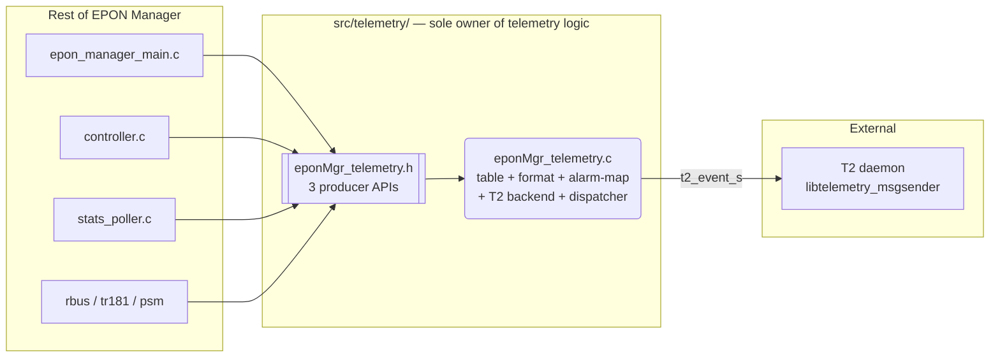
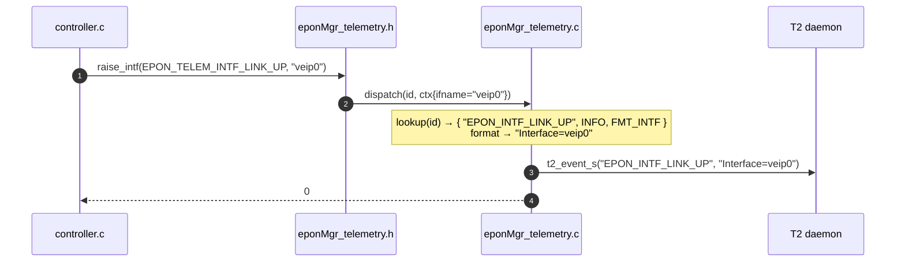
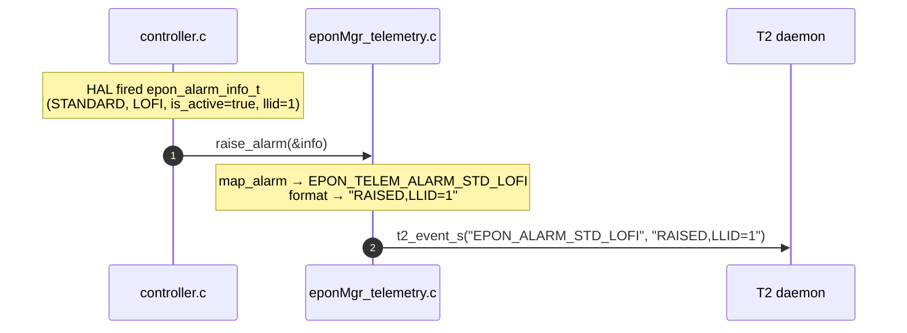
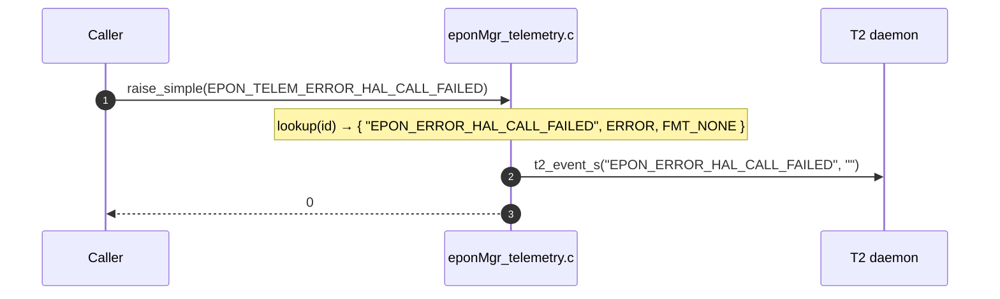
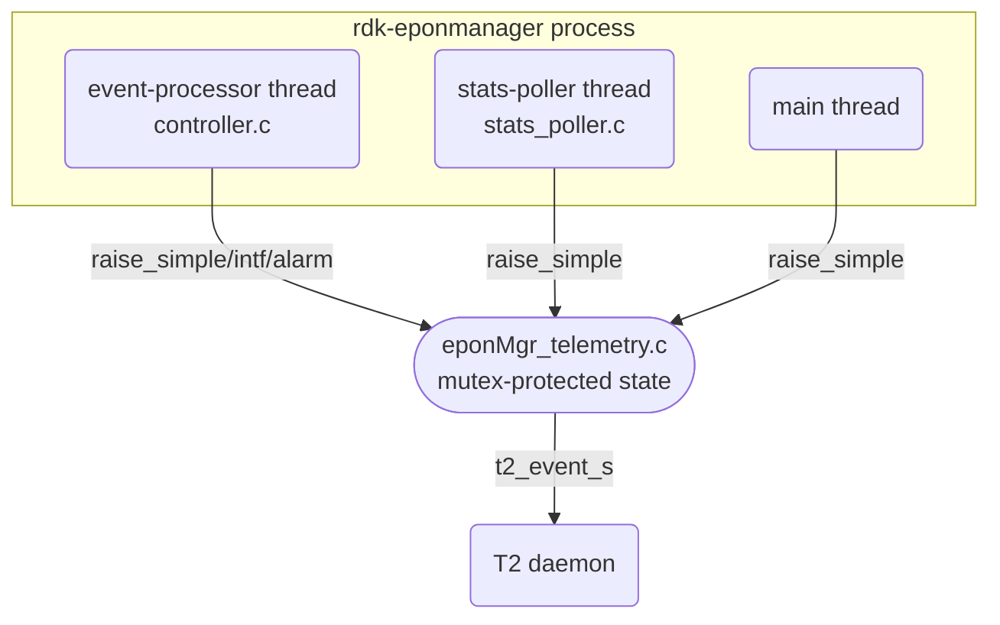
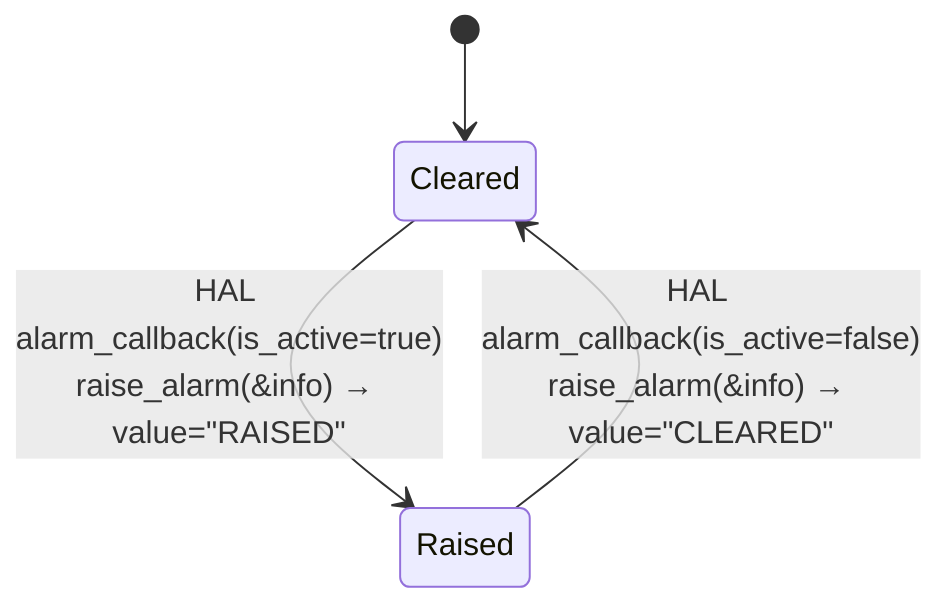

# EPON Manager — Telemetry Design

**Spec:** [08_TR181_Telemetry_Reference.md](08_TR181_Telemetry_Reference.md) §2 (Telemetry Events)
**Acceptance Criteria:** [Telemetry_Acceptance_Criteria.md](Telemetry_Acceptance_Criteria.md)

---

## 1. Design Principles

| # | Principle | Description |
|---|-----------|-------------|
| 1 | Single producer surface | Callers only know event ids. Marker names, severity, value formatting and T2 dispatch are hidden inside `src/telemetry/`. |
| 2 | Replaceable backend | T2 stub vs. real `libtelemetry_msgsender` is selected at link/compile time only. Caller code never changes. |
| 3 | Independent error reporting | T2 backend failure does not cascade to the producer caller; telemetry hiccups are logged and suppressed. |

---

## 2. Key Decisions

| # | Topic | Decision |
|---|-------|----------|
| 1 | Producer API | Three entry points — `_raise_simple()`, `_raise_intf()`, `_raise_alarm()` — backed by a single `dispatch(id, ctx)`. |
| 2 | Alarm raised/cleared | One event id per alarm; `RAISED`/`CLEARED` state encoded in the marker value. |
| 3 | Error events | Simple markers dispatched via `t2_event_s()` like all other events. |
| 4 | Harvester (Avro report) | Out of scope. See [09_Harvester_Future_Direction.md](09_Harvester_Future_Direction.md). |

---

## 3. Public API

Declared in [`include/eponMgr_telemetry.h`](../include/eponMgr_telemetry.h).

```c
typedef enum {
    /* §2.1 ONU Status Events */
    EPON_TELEM_ONU_LOS,
    EPON_TELEM_ONU_DOWNSTREAM_SIGNAL_DETECTED,
    EPON_TELEM_ONU_REGISTRATION,
    EPON_TELEM_ONU_DEREGISTRATION,

    /* §2.2 Interface Link Status Events */
    EPON_TELEM_INTF_LINK_UP,
    EPON_TELEM_INTF_LINK_DOWN,
    EPON_TELEM_PHY_STATUS_UP,
    EPON_TELEM_PHY_STATUS_DOWN,

    /* §2.3 Standard IEEE 802.3ah Alarms (RAISED/CLEARED via ctx) */
    EPON_TELEM_ALARM_STD_LOFI,
    EPON_TELEM_ALARM_STD_ERROR_SYMBOL_PERIOD,
    EPON_TELEM_ALARM_STD_ERROR_FRAME,
    EPON_TELEM_ALARM_STD_ERROR_FRAME_PERIOD,
    EPON_TELEM_ALARM_STD_ERROR_FRAME_SECONDS,
    EPON_TELEM_ALARM_STD_OAM_SESSION_LOST,
    EPON_TELEM_ALARM_STD_EQUIPMENT_FAILURE,

    /* §2.4 Vendor-Specific (DPoE) Alarms */
    EPON_TELEM_ALARM_VENDOR_LOS,
    EPON_TELEM_ALARM_VENDOR_DYING_GASP,
    EPON_TELEM_ALARM_VENDOR_POWER_LOW,
    EPON_TELEM_ALARM_VENDOR_POWER_HIGH,
    EPON_TELEM_ALARM_VENDOR_TEMPERATURE,
    EPON_TELEM_ALARM_VENDOR_FEC_THRESHOLD,
    EPON_TELEM_ALARM_VENDOR_LASER_BIAS_CURRENT,
    EPON_TELEM_ALARM_VENDOR_SUPPLY_VOLTAGE,

    /* §2.5 System Lifecycle */
    EPON_TELEM_SYSTEM_INIT_SUCCESS,
    EPON_TELEM_SYSTEM_INIT_FAILURE,
    EPON_TELEM_SYSTEM_SHUTDOWN,
    EPON_TELEM_SYSTEM_HAL_WRONG_PON_MODE,
    EPON_TELEM_SYSTEM_FACTORY_RESET,
    EPON_TELEM_SYSTEM_ONU_RESET,

    /* §2.6 Error Events */
    EPON_TELEM_ERROR_HAL_CALL_FAILED,
    EPON_TELEM_ERROR_EVENT_QUEUE_FULL,
    EPON_TELEM_ERROR_STATS_COLLECTION_FAILED,
    EPON_TELEM_ERROR_RBUS_PUBLISH_FAILED,
    EPON_TELEM_ERROR_PSM_ACCESS_FAILED,

    EPON_TELEM_EVENT_ID_MAX
} eponMgr_telemetry_event_id_t;

/* Producer APIs */
int eponMgr_telemetry_raise_simple(eponMgr_telemetry_event_id_t id);
int eponMgr_telemetry_raise_intf  (eponMgr_telemetry_event_id_t id, const char *ifname);
int eponMgr_telemetry_raise_alarm (const epon_alarm_info_t *info);

/* Lifecycle */
int eponMgr_telemetry_init   (const char *component_name);
int eponMgr_telemetry_cleanup(void);
```

---

## 4. Architecture



Only `eponMgr_telemetry.h` crosses the module boundary.

---

## 5. Internal Components

All internals are **file-static** within `eponMgr_telemetry.c`.

### 5.1 Event Descriptor Table

```c
typedef enum { PRIO_INFO, PRIO_WARNING, PRIO_ERROR, PRIO_CRITICAL } priority_t;
typedef enum { FMT_NONE, FMT_INTF, FMT_ALARM } fmt_t;

typedef struct {
    const char *marker;
    priority_t  priority;
    fmt_t       fmt;
} event_desc_t;

static const event_desc_t k_table[EPON_TELEM_EVENT_ID_MAX] = {
    [EPON_TELEM_ONU_LOS]        = { "EPON_ONU_LOS",        PRIO_CRITICAL, FMT_NONE  },
    [EPON_TELEM_INTF_LINK_UP]   = { "EPON_INTF_LINK_UP",   PRIO_INFO,     FMT_INTF  },
    [EPON_TELEM_ALARM_STD_LOFI] = { "EPON_ALARM_STD_LOFI", PRIO_CRITICAL, FMT_ALARM },
    /* … 34 rows total — exact text per Reference §2 … */
};
```

### 5.2 Value Formatter

| `fmt`        | Value template                                                |
|--------------|---------------------------------------------------------------|
| `FMT_NONE`   | `""`                                                          |
| `FMT_INTF`   | `"Interface=%s"`                                              |
| `FMT_ALARM`  | `"RAISED"` / `"CLEARED"` (`,LLID=%u` appended when `llid != 0xFFFF`) |

### 5.3 HAL Alarm Mapper

```c
static eponMgr_telemetry_event_id_t map_alarm(const epon_alarm_info_t *info);
```

Maps `info->alarm_type` + standard/vendor enum → event id.

### 5.4 T2 Backend

```c
static int t2_send(const char *marker, const char *value, priority_t prio);
```

-  calls `t2_event_s(marker, value)`.

### 5.5 Dispatcher

`dispatch(id, ctx)`:
- Table-lookup → `format_value` → `t2_send`.

The 3 public `_raise_*` entry points each build a `ctx_t` and call `dispatch`.

---

## 7. Sequence Diagrams

### 7.1 Normal Event



### 7.2 Alarm (RAISED / CLEARED)



### 7.3 Error Event



---

## 8. Threading Model



- Thread-safe via internal `pthread_mutex_t` in `g_state`.
- `t2_event_s` is called **outside** the critical section (non-blocking to callers).

---

## 9. State Machine — Alarm Raised/Cleared



The alarm state is owned by the HAL; the telemetry module is **stateless** —
it forwards each transition as one T2 event.

---

## 10. Error Handling

| Failure | Behaviour |
|---------|-----------|
| `_raise*` called before `_init` | Return `0`; event silently dropped. |
| `_raise*` with unknown id | Return `-1`; log `WARN` once. |
| T2 backend send error | Logged at `WARN`; producer return value unchanged — callers never cascade-fail. |

---

## References

* [08_TR181_Telemetry_Reference.md](08_TR181_Telemetry_Reference.md) — TR-181 parameters and telemetry event spec.
* [Telemetry_Acceptance_Criteria.md](Telemetry_Acceptance_Criteria.md)
* IEEE 802.3ah Clause 57 (OAM) — alarm taxonomy.
* RDK T2 Telemetry Framework — `t2_event_s` API.
