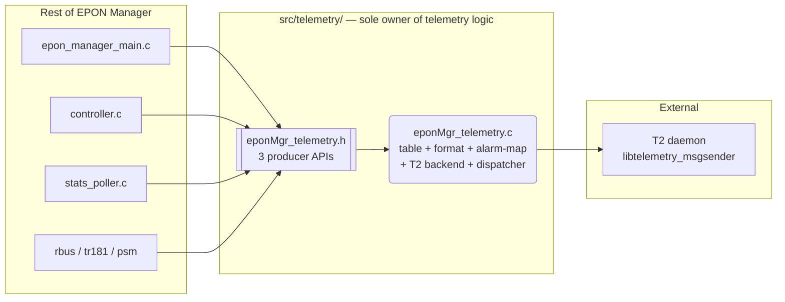
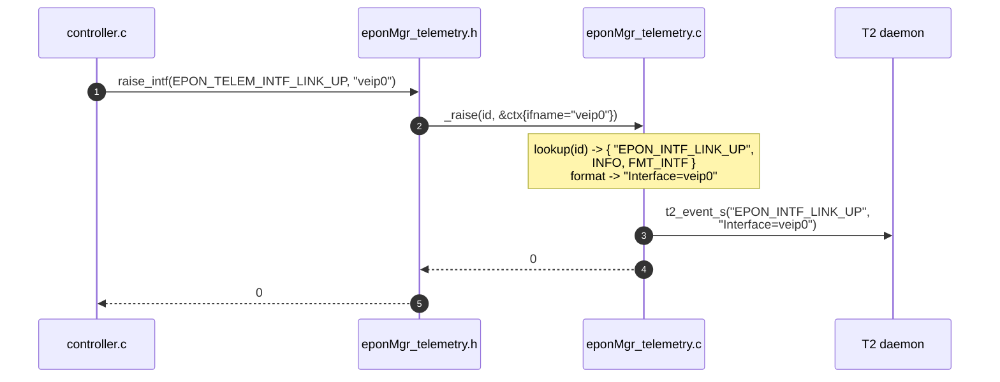
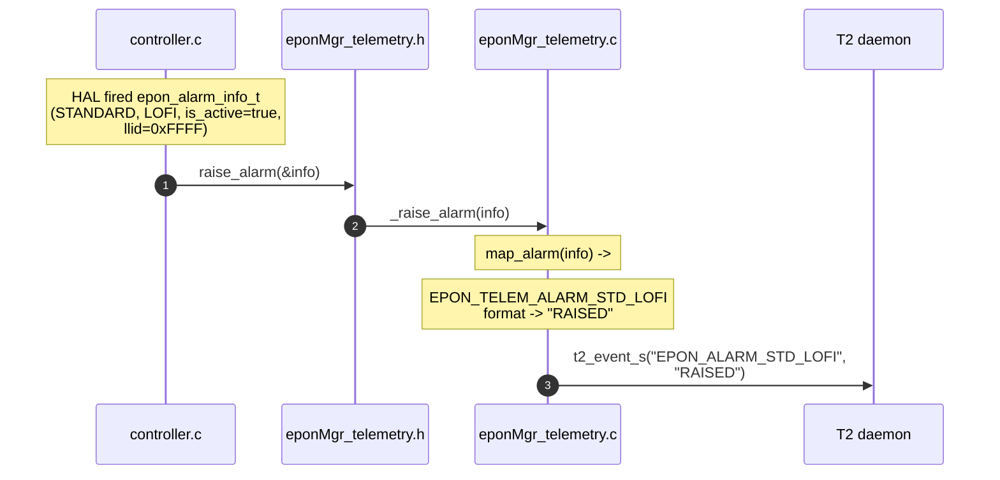
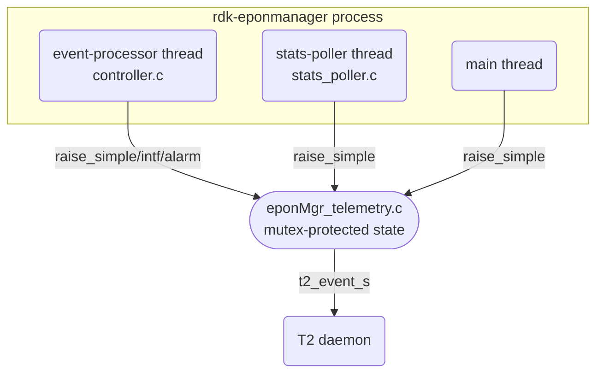
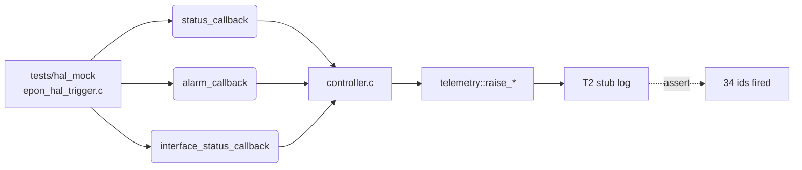

# EPON Manager — Telemetry Module Design

**Version:** 1.1  |  **Date:** May 15, 2026
**Companion:** [07_Telemetry_Implementation_Plan.md](07_Telemetry_Implementation_Plan.md)
**Spec:** [EPON_Manager_Reference_v2.md](EPON_Manager_Reference_v2.md) §2

---

## 1. Design goals

1. **Single producer surface** — the rest of the code base only knows
   *event ids*. Marker names, severity, value formatting and T2 dispatch
   are all hidden inside `src/telemetry/`.
2. **Replaceable backend** — T2 stub vs. real `libtelemetry_msgsender` is
   guarded at link/compile time only. Caller code never changes.

---

## 2. Module boundary

> Only `eponMgr_telemetry.h` crosses the module boundary.

---

## 3. File responsibilities

The telemetry module is implemented in **1 `.c` file** — a single
self-contained module.

| File | Owns |
|------|------|
| `eponMgr_telemetry.h` | Public surface: 34 event ids, 3 producer APIs (`_raise_simple`, `_raise_intf`, `_raise_alarm`), lifecycle APIs. Only header callers ever include. |
| `eponMgr_telemetry.c` | Self-contained event module. Five sections inside the file: (1) const event descriptor table, (2) value formatter (`Interface=…`, `RAISED`/`CLEARED[,LLID=N]`), (3) HAL alarm → event-id mapper, (4) T2 backend (`t2_event_s` shim, log-only when `HAVE_LIBT2` undefined), (5) dispatcher + public init/cleanup/raise. All internals are file-static. |

---

## 4. Event raise — sequence

---

## 5. Alarm raise — sequence (RAISED / CLEARED)

When the alarm clears, the same path runs with `info->is_active=false`
→ value `"CLEARED"`.

---

## 6. Threading model

* Producer side is fully thread-safe — internal mutex in `eponMgr_telemetry.c`.
* Multiple threads may call `_raise*` concurrently; the internal mutex
  serializes state updates (event counts) but `t2_event_s()` itself is
  called outside the critical section.

---

## 7. State machine — alarm raised/cleared encoding

The state itself is owned by HAL; the telemetry module is **stateless**
with respect to alarms — it forwards each transition as one T2 event.

---

## 8. Error & resource handling

| Failure | Behaviour |
|---------|-----------|
| `_raise*` called before `_init` | Return `-1`; no log spam (rate-limited). |
| `_raise*` with unknown id | Return `-1`; log once. |
| T2 backend send error | Logged at `WARN`; producer return value unchanged (success), so callers don't cascade-fail on telemetry hiccups. |

---

## 9. Test plan

Test driver iterates the trigger harness through every code path and
verifies all 34 event ids are observed.

---

## 10. Reference

* [EPON_Manager_Reference_v2.md](EPON_Manager_Reference_v2.md) — TR-181, telemetry spec.
* IEEE 802.3ah Clause 57 (OAM) — alarm taxonomy.
* RDK T2 Telemetry Framework — marker semantics.
