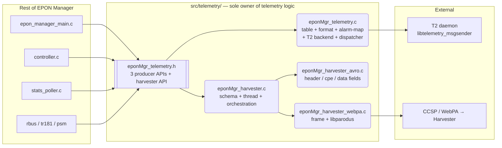
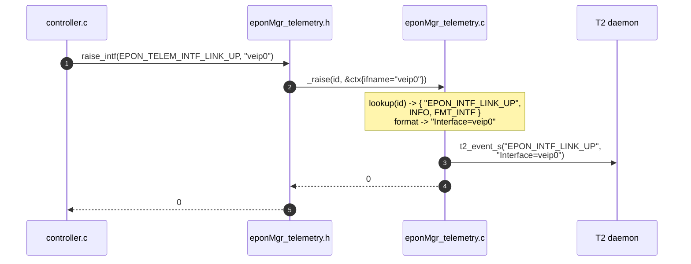
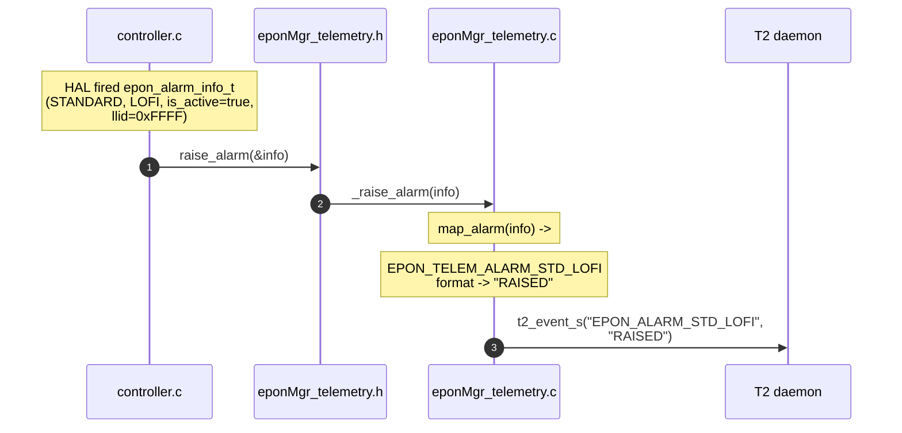
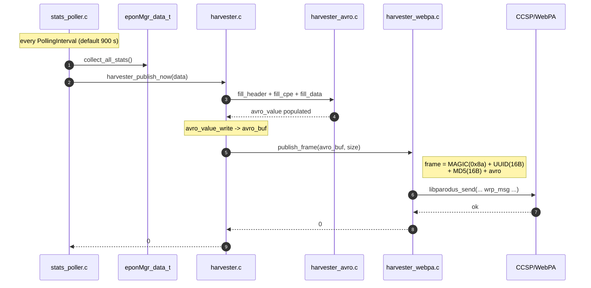
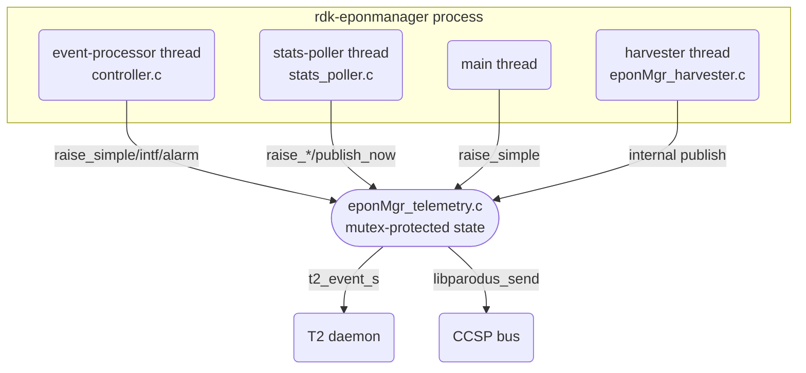
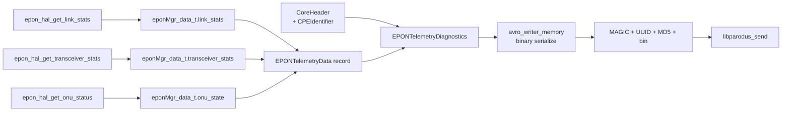
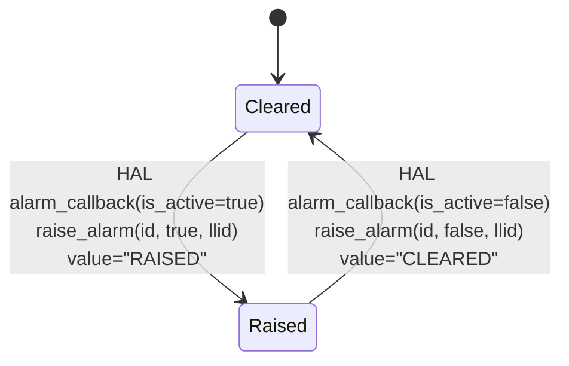
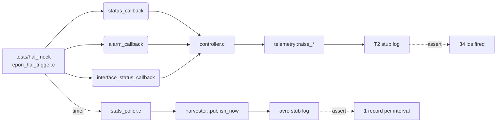

# EPON Manager — Telemetry & Harvester Module Design

**Version:** 1.0  |  **Date:** April 30, 2026
**Companion:** [07_Telemetry_Implementation_Plan.md](07_Telemetry_Implementation_Plan.md)
**Spec:** [EPON_Manager_Reference_v2.md](EPON_Manager_Reference_v2.md) §2 / §3

---

## 1. Design goals

1. **Single producer surface** — the rest of the code base only knows
   *event ids*. Marker names, severity, value formatting, T2 dispatch,
   and Avro encoding are all hidden inside `src/telemetry/`.
2. **Two independent sub-pipelines** sharing one module boundary:
   - **Event pipeline** — discrete markers via T2 (`t2_event_s`).
   - **Harvester pipeline** — periodic `EPONTelemetryDiagnostics` Avro
     record over CCSP/WebPA, modeled on `rdk-xdslmanager`.
3. **Replaceable backends** — T2 stub vs. real `libtelemetry_msgsender`,
   and harvester stub vs. real `sendWebpaMsg` are guarded at link/compile
   time only. Caller code never changes.

---

## 2. Module boundary

> Only `eponMgr_telemetry.h` crosses the dashed boundary.

---

## 3. File responsibilities

The telemetry module is implemented in **4 `.c` files + 1 private header**
— each file owns a complete, self-contained responsibility.

| File | Owns |
|------|------|
| `eponMgr_telemetry.h` | Public surface: 34 event ids, 3 producer APIs (`_raise_simple`, `_raise_intf`, `_raise_alarm`) and 3 harvester APIs. Only header callers ever include. |
| `eponMgr_telemetry.c` | Self-contained event module. Five sections inside the file: (1) const event descriptor table, (2) value formatter (`Interface=…`, `RAISED`/`CLEARED[,LLID=N]`), (3) HAL alarm → event-id mapper, (4) T2 backend (`t2_event_s` shim, log-only when `HAVE_LIBT2` undefined), (5) dispatcher + public init/cleanup/raise. All internals are file-static. |
| `eponMgr_harvester.c` | Schema load (`.avsc` once), periodic thread (`pthread_cond_timedwait`), `build_and_ship` orchestration, public `eponMgr_harvester_init/_publish_now/_cleanup`. |
| `eponMgr_harvester_avro.c` | Avro encoding for the three sub-records: Kestrel `CoreHeader` (timestamp, uuid v4, source), `CPEIdentifier` (gateway MAC, cpe_type), and `EPONTelemetryData` (32 fields from `eponMgr_data_t`, including float→Dbm1000 conversion). |
| `eponMgr_harvester_webpa.c` | Frames `[MAGIC \| UUID \| MD5 \| avro]` and ships via `libparodus`. Carries the optional `HAVE_LIBPARODUS` and `HAVE_LIBCRYPTO` `#ifdef` boundaries. Falls back to a logging stub when libparodus is absent. |
| `eponMgr_harvester_priv.h` | Private header shared by the three harvester sources. Declares `eponMgr_harv_fill_header/_cpe/_data` and `eponMgr_harv_publish_frame`, plus framing constants. NOT installed. |

---

## 4. Event raise — sequence

---

## 5. Alarm raise — sequence (RAISED / CLEARED)

When the alarm clears, the same path runs with `info->is_active=false`
→ value `"CLEARED"`.

---

## 6. Harvester pipeline — periodic publish

---

## 7. Threading model

* Producer side is fully thread-safe — internal mutex in `eponMgr_telemetry.c`.
* Harvester thread owns its own `pthread_cond_t` for timed wait + early
  wakeup on shutdown / interval change.
* `harvester_publish_now()` may be invoked from any thread (stats poller
  or harvester thread itself); serialization handled inside the publisher.

---

## 8. Data flow inside the harvester report

Mapping is locked to [Reference §3.1.2–3.1.4](EPON_Manager_Reference_v2.md#312-link-statistics).

Field correspondence (32 Avro fields ← TR-181 / HAL):

| Avro field | Source struct field |
|------------|---------------------|
| `BytesSent / BytesReceived / PacketsSent / …` | `epon_hal_link_stats_t` |
| `FECCorrected / FECUncorrectable / RangingResyncs / MACResets` | `epon_hal_link_stats_t` (extensions) |
| `BER` | derived in stats poller |
| `TransmitOpticalLevel / OpticalSignalLevel` | `epon_hal_transceiver_stats_t` |
| `LowerOpticalThreshold / UpperOpticalThreshold / Lower/UpperTransmitPowerThreshold` | `epon_hal_transceiver_stats_t` |
| `TransceiverTemperature / SupplyVoltage / LaserBiasCurrent` | `epon_hal_transceiver_stats_t` |
| `OperationalMode / EncryptionMode / ONUStatus` | `eponMgr_onu_state_t` |
| `MaxBitRate` | `eponMgr_data_t.max_bit_rate` |

---

## 9. State machine — alarm raised/cleared encoding

The state itself is owned by HAL; the telemetry module is **stateless**
with respect to alarms — it forwards each transition as one T2 event.

---

## 10. Error & resource handling

| Failure | Behaviour |
|---------|-----------|
| `_raise*` called before `_init` | Return `-1`; no log spam (rate-limited). |
| `_raise*` with unknown id | Return `-1`; log once. |
| T2 backend send error | Logged at `WARN`; producer return value unchanged (success), so callers don't cascade-fail on telemetry hiccups. |
| Avro encode error in harvester | Whole report skipped; `EPON_TELEM_ERROR_HAL_CALL_FAILED` event raised (avoids reporting infinite recursion via guard flag). |
| `libparodus_send` error | Logged at `WARN`; record dropped; next interval retries. |
| Schema file missing | `harvester_init` returns `-1`; harvester thread does not start; producer events still work. |

---

## 11. Test plan (mapped to acceptance criteria §9 of plan)

Test driver iterates the trigger harness through every code path and
verifies the two assertions.

---

## 12. Reference

* [EPON_Manager_Reference_v2.md](EPON_Manager_Reference_v2.md) — TR-181, telemetry, harvester spec.
* `rdkxdslmanager/source/TR-181/integration_src.shared/xdsl_report.{c,h}` — reference implementation of the harvester pattern (Avro + WebPA + magic-byte framing).
* Apache Avro 1.11 C API.
* IEEE 802.3ah Clause 57 (OAM) — alarm taxonomy.
* RDK T2 Telemetry Framework — marker semantics.
